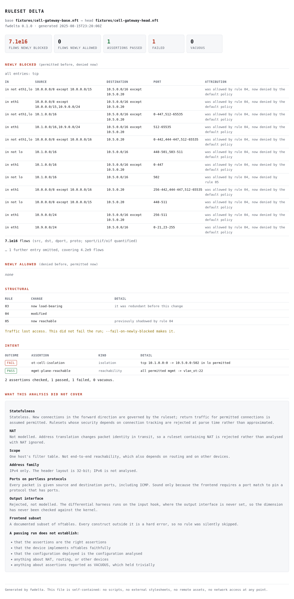

# fwdelta

Semantic diff and formal reachability analysis for firewall policy under version
control.

> fwdelta takes two firewall rulesets and prints exactly which packets changed
> status between them, so a reviewer sees the behavioural delta instead of a
> text delta.

**Status: v1.0.0.** The blueprint's release model has no public 0.x: the
repository goes public at `v1.0.0` with the parser, engine, diff and enumerator
complete and tested, because partial capability shipped early reads as abandoned
work.

The published `x86_64-unknown-linux-musl` binary for this tag:

```
sha256  b66b3072a53e0e8b142dc1b13b2a8b40bbf3c6304dec805a88989346bb732b0b
```

Rebuild it yourself with `scripts/reproducible-build.sh --digest`. The toolchain
is pinned in `rust-toolchain.toml` and the dependency graph in `Cargo.lock`, both
committed, so the only remaining variable is the host.

## The problem

A firewall ruleset is reviewed as text. A firewall behaves as a set of permitted
packets. Nothing in the review process connects the two.

Rules are evaluated first-match, and that single property makes every edit
non-local. Narrowing a source range on rule 14 can expose rule 22, which was
previously shadowed and therefore dead, and which now matches traffic nobody has
thought about in two years. A reviewer looking at a unified diff sees one line
changed. The second-order effects are not in the diff; they are in the
interaction between the changed line and the two hundred lines around it.

```
RULESET DELTA  base 9f2c1ab .. head 4e81d33

NEWLY BLOCKED  (permitted before, denied now)
  all entries: in not lo, tcp
    10.0.0.0/8 except 10.0.0.0/15,10.9.0.0/24 -> 10.5.0.0/16 except 10.5.0.20              was allowed by rule 04, now denied by the default policy
    10.1.0.0/16                               -> 10.5.0.0/16                  :502         was allowed by rule 04, now denied by rule 05
  7.1e16 flows  (src, dst, dport, proto; sport/iif/oif quantified)

NEWLY ALLOWED  (denied before, permitted now)
  none

STRUCTURAL
  rule 03  now load-bearing  it was redundant before this change
  rule 04  modified
  rule 05  now reachable     previously shadowed by rule 04
```

One line changed in the file. Three rules changed behaviour.

### HTML reports

`--format html` writes one file with everything in it: all CSS inline, all data
in the markup, no scripts at all. No `<script src>`, no `<link href>`, no
webfonts, no remote images, no `fetch`. It opens from `file://` on a machine
with no network, which is the point — a report about an air-gapped network's
firewall is not much use if reading it needs a CDN, and one that phones home
when opened is an exfiltration path for a document describing exactly where the
trust boundaries are.

CI greps the generated file for every one of those patterns and runs the
syscall audit over an HTML run, so this path is covered by the same air-gap gate
as everything else.

[](examples/cell-gateway-report.html)

*[examples/cell-gateway-report.html](examples/cell-gateway-report.html),
generated from the fixtures in this repository. The model boundaries are on the
page rather than in a footnote: anyone reading a report should be able to see
what the analysis did not cover without going to find the documentation.*

The text and HTML renderers are two pure functions of one `DiffReport`, not two
formatting paths. Ordering by breadth, hoisting constant columns, deriving
omission from the union rather than by summing, attributing on both sides — all
of that happens once, in the build step. A test asserts the two agree on the set
of findings and on every count, because a reviewer comparing an HTML report
against the terminal would otherwise have no way to tell which one was lying.

## What it does not do

Stated as hard boundaries, because each is a legitimate problem and each is
someone else's.

- **Multi-hop reachability.** One host's filter table. No topology graph, no
  routing table, no BGP or OSPF simulation. If you need end-to-end reachability
  across a routed network, you need [Batfish](https://batfish.org), and the
  referral is made honestly.
- **NAT.** Address translation changes packet identity in transit. A ruleset
  containing NAT is rejected with a clear message rather than analysed with NAT
  ignored.
- **Full stateful semantics.** See the soundness boundaries below.
- **Runtime enforcement.** fwdelta never connects to a device, never reads a
  running configuration and never pushes one. Configuration text is the only
  input.
- **Traffic analysis.** No packet capture, no flow records, no live observation.

## Soundness boundaries

A verification tool that is wrong is worse than no tool, because it converts
uncertainty into false confidence. The full treatment is
[docs/SEMANTICS.md](docs/SEMANTICS.md); the headlines:

| Limit | Consequence |
|---|---|
| Stateless approximation | Return traffic for permitted connections is assumed permitted. Rulesets whose security depends on asymmetric conntrack behaviour are rejected at parse time, not approximated. |
| No NAT | Filter semantics only. |
| Single host | Results describe one device's policy, not end-to-end reachability, which also depends on routing. |
| IPv4 | The header layout is 32-bit. IPv6 needs a 296-bit layout and is a version-two concern. |
| Ports on portless protocols | The model gives every packet ports, including ICMP. Sound only while port matches pin a port-bearing protocol, which the frontend enforces. |

**What a passing run establishes:** that the modelled ruleset permits exactly the
packet set computed, under the stated model, and satisfies the stated assertions.

**What it does not establish:** that the assertions are the right assertions;
that the device implements nftables faithfully; that the configuration deployed
is the configuration analysed; that anything is true about NAT, routing, or other
devices.

### On the air-gap evidence specifically

The two mechanisms above cover different halves and neither is sufficient alone,
which is worth stating plainly rather than letting the table imply otherwise.

`cargo deny` is static and total over the dependency graph, but it matches crate
*names*: it cannot tell that a crate opens a socket, and `libc` is FFI to
everything. `strace` observes what the binary actually did, but only on the code
paths the audit run reached — a socket call sitting in an unexercised branch
would not show up.

Together they are a reasonable pair: the denylist catches an unwanted dependency
at review time, and the audit catches one that slipped through at runtime.
Neither is a proof that the binary cannot open a socket, and the project does not
claim one. The strongest available statement is that no known network-capable
crate is in the graph and no socket syscall occurs on the analysis path.

## How the claims are checked

Every claim above has a mechanism behind it, and each runs in CI.

| Claim | Mechanism |
|---|---|
| The model matches the kernel | `fwdelta-kerneldiff` loads generated rulesets into an unprivileged network namespace, sends real packets, and reads per-rule counters for the real verdict. Disagreement is a failing test with a reproducible seed. |
| The harness can actually fail | `--self-test` injects five deliberately broken models and requires every one to be detected. A fault that survives means the dimension it breaks is untested. |
| Probes exercise every dimension | Coverage is computed from the probes actually sent and printed on every run. A dimension held constant fails the run. |
| No network access | Two complementary mechanisms, neither of which is a proof alone. `deny.toml` is static: it bans network-capable crates by name across the whole graph, but cannot detect capability by analysis. `scripts/syscall-audit.sh` is dynamic: it straces the binary and fails on a single socket syscall, which establishes that none occurred **on the paths the audit run exercised** — not that none exists in the binary. A socket call in an unreached branch would not appear. See below. |
| One file, no dependencies | Static musl build, verified statically linked in CI. |
| The build is reproducible | `scripts/reproducible-build.sh` builds twice and requires identical digests; the toolchain is pinned in `rust-toolchain.toml` and the graph in `Cargo.lock`, both committed. Two builds on one host catch embedded paths and timestamps; cross-machine reproducibility is what publishing the digest is for. |
| No unsafe in first-party code | `#![forbid(unsafe_code)]` at every crate root. |
| The parser has a boundary | [docs/NFTABLES-SUBSET.md](docs/NFTABLES-SUBSET.md), with a test asserting the cause and position of every rejection. |
| No accepted match is silently dead | [docs/HOOK-MATCH-MATRIX.md](docs/HOOK-MATCH-MATRIX.md) sweeps every hook against every match type with real nftables and counters. Two combinations load and are then ignored by the kernel; both are rejected by the frontend. This class is invisible to the differential harness, which generates rulesets from the model it is testing. |
| Every dimension a ruleset can constrain has been falsified | Each is broken deliberately by an `--inject-fault` mode and the harness is required to detect it. `oifname` is rejected by the frontend rather than shipped, precisely because the harness cannot exercise the output hook and so cannot falsify it. |
| The engine agrees with itself | The accept set is derived two independent ways and `ChainModel::verify` requires them to match, alongside the partition invariant. |

## Repository

```
crates/ir          what a rule says: seven match dimensions, 120 bits
crates/engine      what it means: BDD encoding, accept sets, diff, enumeration
crates/nft         the nftables frontend
crates/cli         the `fwdelta` binary
crates/kerneldiff  differential testing against the Linux kernel
fixtures/          rulesets used by the tests, validated against real nft in CI
docs/SEMANTICS.md         the specification the implementation is reviewed against
docs/DECISIONS.md         architectural decisions, with the reasoning and the cost
docs/NFTABLES-SUBSET.md   the frontend's boundary
docs/HOOK-MATCH-MATRIX.md hook x match, swept against the kernel
docs/nftables-hook-match-applicability.md
                          standalone writeup of the sweep, useful without this tool
```

## Building

```sh
cargo test --workspace
cargo build --release --target x86_64-unknown-linux-musl

# check the build reproduces, and print the digest a third party can compare
scripts/reproducible-build.sh

# or run it from a container with nothing else in it
podman build -t fwdelta -f Containerfile .
podman run --rm -v "$PWD:/work:ro" fwdelta diff --base /work/base.nft --head /work/head.nft
```

Comparing two revisions:

```sh
fwdelta diff --base fixtures/cell-gateway-base.nft \
             --head fixtures/cell-gateway-head.nft

# or against git history, which is the CI shape
fwdelta diff --base main --head HEAD --path cell-gateway.nft

# machine-readable, untruncated, counts as strings so 2^120 survives
fwdelta diff --base main --head HEAD --path cell-gateway.nft --format json

# a single self-contained HTML file, for attaching to a review
fwdelta diff --base main --head HEAD --path cell-gateway.nft \
             --format html --out delta.html

# what is dead in a single ruleset
fwdelta check cell-gateway.nft

# with intent assertions, and an attestation for the audit trail
fwdelta diff --base main --head HEAD --path cell-gateway.nft \
             --assert policy.toml --attest fwdelta.intoto.json
```

Assertions are TOML, and zones let a claim be written in IEC 62443 vocabulary
rather than in CIDRs:

```toml
[zones]
vlan_corp = ["10.1.0.0/16"]
vlan_ot   = ["10.5.0.0/16"]

[[assert]]
name  = "ot-cell-isolation"
kind  = "isolation"        # or "reachability"
from  = "vlan_corp"
to    = "vlan_ot"
proto = "tcp"
dport = 502
```

An assertion has three outcomes, not two. `PASS` and `FAIL` are the obvious
ones; **`VACUOUS`** means the property held trivially — nothing in the ruleset
decides the packets the assertion describes, so the check established nothing.
That is what a slipped digit in a zone produces, and reporting it as a pass
would be the policy-file version of a parser silently skipping a rule: the build
stays green and the check meant to catch the problem is the thing that failed.
Vacuous assertions fail the run by default; `--allow-vacuous` downgrades them.

The attestation is an unsigned in-toto predicate. It carries the ruleset
digests, the tool version, the assertion results **and the model's boundaries**
— an auditor reading it can see that the analysis was stateless, IPv4-only, over
one host's filter table, and what it therefore does not establish. Sign it
detached with your own tooling: fwdelta holds no key material, which is the same
promise as never connecting to a device.

Exit codes are the whole interface as far as a pipeline is concerned: `0`
completed with no gate failed, `1` a gate failed, `2` the tool could not
analyse the input. A ruleset outside the supported subset always exits `2` —
a green build from a ruleset that was never modelled is the outcome this
project exists to prevent.

The differential harness needs `nftables`, `iproute2`, `socat` and unprivileged
user namespaces. It needs no root.

```sh
cargo run --release -p fwdelta-kerneldiff -- --self-test
cargo run --release -p fwdelta-kerneldiff -- --rules 50 --packets 120 --rounds 4
```

## Prior art

- **Fireman** (Yuan et al., IEEE S&P 2006) — the BDD encoding of ACL header space
  and the shadowing/redundancy taxonomy. Unmaintained; the encoding is the right
  one and is used here.
- **Header Space Analysis** (Kazemian et al., NSDI 2012) — reachability as set
  algebra over a header bit vector.
- **Batfish** (Fogel et al., NSDI 2015) — defines the boundary of this project's
  scope by occupying everything beyond it. Where the two overlap, Batfish is
  deeper. fwdelta is not a Batfish competitor and does not attempt to become one:
  the contribution is that the analysis runs unprompted, on every pull request,
  and produces output a human reads in five seconds.

## Licence

Apache-2.0.
